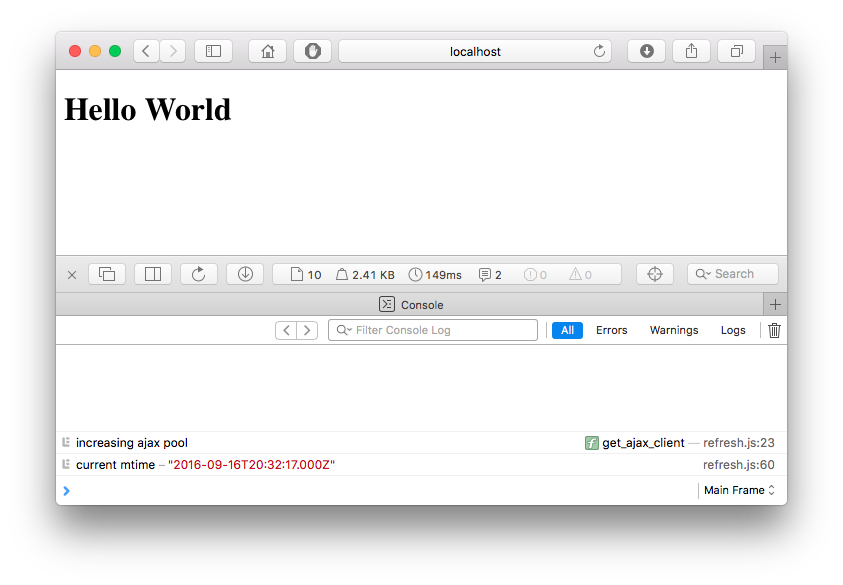
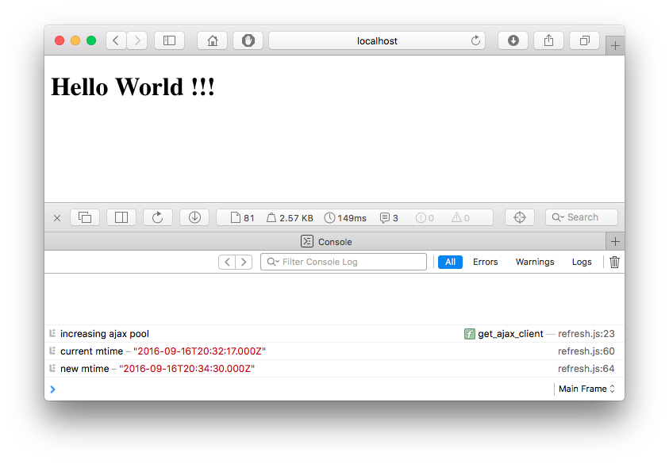

<h1>Kiosk</h1>

A minimal self-refreshing HTML Kiosk.  
Christophe VG - <contact@christophe.vg>  
[https://github.com/christophevg/kiosk](https://github.com/christophevg/kiosk)

## Introduction

This minimal HTML Kiosk, consists of a top-level index page that holds no content itself, but hosts an inline frame displaying the actual content. Next to that it monitors the last modification date of the content and refreshes the content when it changes.

### A Minimal Webserver

As we use AJAX to query the local file system, this doesn't play nice without a real webserver, so make sure you have python and ...

```bash
$ make run
*** starting a simple HTTP webserver
Serving HTTP on 0.0.0.0 port 8080 ...
```

### The Kiosk

Visit `http://localhost:4000/src/index.html` in your browser (and open the console for some informative feedback):



Finally, in your favorite editor, modify the content page and save it again.  
Let's say, we add a few exclamation marks...



Voila, ... within one second, the content is refreshed, ... only when the content has actually changed.

Now you can setup background processes that change the content and your kiosk will always be up to date.